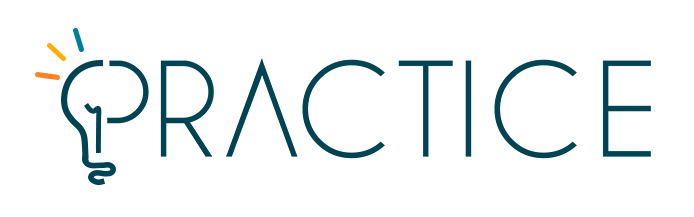

<p align="center">
    <br />
    
    
</p>

# PRACTICE Enquete

O PRACTICE Enquete tem como objetivo fornecer à comunidade acadêmica o serviço de criação de formulários e enquetes interativos e dinâmicos de forma ágil e simples, possibilitando responder via link ou QR-Code e assistir a evolução dos resultados em tempo real. O principal diferencial é que a criação das enquetes será muito prática: o usuário escreve um pequeno texto que é automaticamente interpretado e transformado em um lindo e maravilhoso formulário.

> **IMPORTANTE:** este projeto não possui fins lucrativos.

## Tecnologias utilizadas

Em resumo, as tecnologias uilizadas tanto no client como no server são as seguir:

- [Docker](https://www.docker.com/) - Para criação e gerenciamento dos bancos de dados
- [PostgreSQL](https://www.postgresql.org/) - Para armazenar e gerenciar todos os dados
- [Node.js](https://nodejs.org/en/) 15.8.0 - Para executar client e server (instalar via [nvm](https://github.com/nvm-sh/nvm))
- [Typescript](https://www.typescriptlang.org/) - Para tornar o JavaScript ainda mais poderoso e rápido de utilizar
- [GraphQL](https://graphql.org/) - Para criar e utilizar endpoints interativos, dinâmicos e robustos

## Executanto a API

 Antes de executar a API, é necessário iniciar os bancos de dados utilizando o Docker. Isso pode ser feito a partir da pasta raiz do projeto conforme é mostrado logo abaixo:

```
docker-compose up -d
```

Após isso, é possível rodar a API utilizando os comandos abaixo:

```
cd server
npm install
npm start
```

Para mais informações específicas do server, [clique aqui](./server/).

## Executanto o client

```
cd client
npm install
npm start
```

Para mais informações específicas do client, [clique aqui](./client/).

## Contribua

Sua ajuda é muito bem-vinda, independente da forma! Confira o arquivo [CONTRIBUTING.md](CONTRIBUTING.md) para conhecer todas as formas de contribuir com o projeto. Por exemplo, [sugerir uma nova funcionalidade](https://github.com/ccuffs/template/issues/new?assignees=&labels=&template=feature_request.md&title=), [reportar um problema/bug](https://github.com/ccuffs/template/issues/new?assignees=&labels=bug&template=bug_report.md&title=), [enviar um pull request](https://github.com/ccuffs/hacktoberfest/blob/master/docs/tutorial-pull-request.md), ou simplemente utilizar o projeto e comentar sua experiência.

Veja o arquivo [ROADMAP.md](ROADMAP.md) para ter uma ideia de como o projeto deve evoluir.

## Licença

Esse projeto é licenciado nos termos da licença open-source [Apache 2.0](https://choosealicense.com/licenses/apache-2.0/) e está disponível de graça.

## Changelog

Veja todas as alterações desse projeto no arquivo [CHANGELOG.md](CHANGELOG.md).
